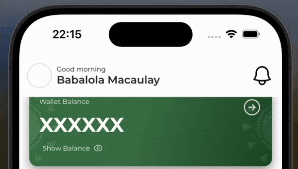

# react-native-toast-alert

An awesome package for cool toast alerts in react-native 🚀

```js
Toast.success("Welcome. you will definitely love this toast package.😉")
```

<div style="margin-bottom: 20px;display: flex">
  
  
</div>
<div style="margin-bottom: 20px;display: flex">
  
  
</div>

## [View Live Demo](https://snack.expo.dev/iIRGkATiUtxLMDUwNYLp7)

## Installation

```sh
npm install react-native-toast-alert
```

## Usage

### 👉🏽 Step 1

Import `ToastManager` and `Toast`.

```js
// ...
import ToastManager { Toast } from 'react-native-toast-alert'
```

### 👉🏽 Step 2

Add `ToastManager` component to the top of your app component structure.
```js
const App = () => {
  return (
    <View>
      <ToastManager />
      <App>
        // Other parts of your application content can go here
      </App>
    </View>
  )
})
```

### 👉🏽 Step 3 (Final Step)

Call any of the `Toast` methods directly

```js
const App = () => {
  // ...

  const showSuccessToast = () => {
    Toast.success("Yaay!!! You made it here...🚀🚀🚀")
  }

  const showErrorToast = () => {
    Toast.error("Error, looks like something went wrong.🙁")
  }

  const showInfoToast = () => {
    Toast.info("Hi, you're still online.")
  }

  const showWarningToast = () => {
    Toast.warning("Your wallet balance is running low.")
  }

  return (
    <View>
      <ToastManager />
      <Touchable
        onPress={() => showSuccessToast()}
      >
        Show
      </Touchable>
    </View>
  )
})

// ...
```
## Note:
Each of the methods on the toast take 2 parameters: The toast message and an optional list of configuration options.

## Options for Configuraton
| Option | Description | Type | Default Value |
| --- | --- | --- | --- |
| duration | How long the toast will be visible for (milliseconds) | number | 2000 |
| withIcon | If there should be an icon in the alert | boolean | true |
| icon | Custom icon image. Works only if `withIcon` is set to `true` | ImageSourcePropType | undefined |
| progress | Show progress bar | boolean | false |
| bounce | Add bounce effect while showing toast | boolean | false |
| autoDismiss | Dismiss toast automatically | boolean | true |
| centerText | Align the text in the toast centrally | boolean | false |
| dismissMode | How to dismiss the toast manually. (This is useful if you set autoDismiss to false) | 'tap' or 'swipe' | tap |

## Happy Coding 🥂

<!-- ## TODO
1. Add custom style to alert
2. Allow custom callback
3. Add option to disiss alert manually
4. Display custom component -->

## Contributing

See the [contributing guide](CONTRIBUTING.md) to learn how to contribute to the repository and the development workflow.

## License

MIT

---

<!-- Made with [create-react-native-library](https://github.com/callstack/react-native-builder-bob) -->
